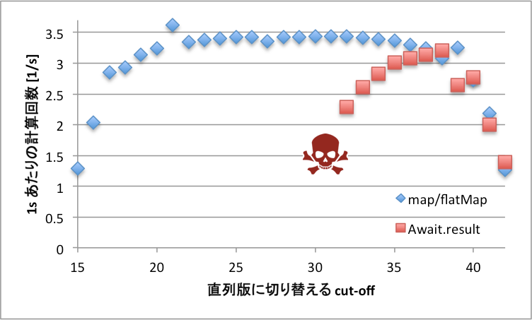

Await.result は避けよう
=====================

[Scala]

Scala で Future をほとんど使わず、使っても `Await.result` ばかりのコードを見てしまったため書きました。

# 理由: スケールしないから

`Await.result` で同期するコードはタスク数を増やしたときにうまく動作しません。この意味をフィボナッチ数を例に示したいと思います。フィボナッチ数の計算は無駄にタスクをフォークしまくり、余計な要素もほぼないので、今回のようにタスク数をやたら多くしたいときにこれ以上なくとても都合が良い題材です。

ソースコードを示します。上が Future と `map`/`flatMap` を使っているもの、[^2] 下が `Await.result` を使っているものです。`Await.result` 版のスタイルの方が、for 式とか使わなくてもスッキリ書けるし、もっと複雑になったときの合成可能性も良いということで好む人もいるようです。 (結局上も `Await.ready` を使っているではないか、と突っ込みたくなった人は下の補足を見てください。。)

[^2]: for式はコンパイル中に map, flatMap, foreach, withFilter, filter メソッドの呼び出しに変換されます。

```future.scala
def fib(n: Int): Future[Int] =
  if (n < th) Future(sfib(n)) // カットオフ
  else (Future {
    val f1 = fib(n - 1)
    val f2 = fib(n - 2)
    for (x1 <- f1; x2 <- f2) yield x1 + x2
  }).flatten
Await.ready(fib(S), duration.Duration.Inf)
```

```await.scala
def fib(n: Int): Future[Int] =
  if (n < th) Future(sfib(n)) // カットオフ
  else Future {
    val f1 = fib(n - 1)
    val f2 = fib(n - 2)
    val x1 = Await.result(f1, duration.Duration.Inf)
    val x2 = Await.result(f2, duration.Duration.Inf)
    x1 + x2
  }
Await.ready(fib(S), duration.Duration.Inf)
```

ところでこのソースコードにはカットオフ処理を入れてあり、しきい値未満になると直列版に切り替えます。あとの実験ではこの値を変化させます。これは普通並列計算では並列化のオーバーヘッドがあるのである程度粒度大きくしなるように工夫するのが普通だからです。でないと計算時間のほとんどがオーバーヘッドとかいうマヌケな話になってしまいますから。[^1]逆に大きすぎても、十分な並行性が得られず並列化に失敗してしまいます。世の中にはこの辺を自動で調整してくれるフレームワークもあるようですが、Scala の Future はそこまで賢くないので手作業でやっています。調整は面倒なのでいい感じに動いてくれる粒度の範囲が広い方が嬉しいですね。

[^1]: 実際のところ論文とかでもその領域だけ見て速くなった・遅くなったとかいうのは頻繁に遭遇したので笑えない…

## 実験結果

では、このソースコードを用いて`fib(42)`の計算した結果を示します。Scala は最近出た 2.12.0, Java は OracleJDK 1.8.0_60, マシンは手元の4年前の Macbook Pro で CPU が 2.6 GHz Intel Core i7、4コア8スレッドのものです。本当は Mobile 用の CPU は速度が変わるし、コア数もそんなに大きいマシンでないのであまり適していないのですが手元になかったので諦めました。以下がそのグラフで横軸がカットオフのしきい値で左にいくほど粒度が小さくタスク数が多くなります。また、縦軸は1秒あたりの計算回数で、上に行くほど高速ということを示します。◆ (map/flatMap) が上のソースコードの結果で、■ (Await.result) が下のソースコードの結果です。




map/flatMap の方は35~20くらいまで安定して性能を発揮しており、粒度が小さく、タスク数が増大した場合でもそれなりに動いてくれることが示唆されます。

一方、Await.result の方は37をピークに緩やかに性能が低下していっており、タスク数が増えると直ちに性能に影響が出ることが示唆されます。なお、31からは測定不能なため、代わりにドクロマークを置いておきました。これは、スレッド数の上限に達してタスクスケジューラがデッドロックを起こしてしまい測定不能なためです。

これらから言えることは、Await.result の方は次の2つの欠点が存在する可能性があるということです。
1. タスクが増えたときに性能が下がるのが早い
2. その上、さらにタスクが増えるとタスクスケジューラがデッドロックを起こしてそもそも計算が終わらなくなる

## より詳しい解説

Scala の Future 基本的に、コア数分くらいのワーカースレッドを立てておいて、`Future`メソッド(正確には`Future.apply`)でスケジューラに登録した多数のタスクを1個ずつ順に処理させる仕組みになっています。なお、1度実行を始めたタスクを一時中断して後で再開するような仕組みは基本的にないので、ワーカースレッドに長時間居座るタスクが存在するとスケジューリングに支障が出ます。

map/flatMap と Await.result はそれぞれこのフレームワークにおいて依存するタスクの結果を利用する方法ですが、仕組みが異なります。まず map/flatMap は、Future の仕組みとマッチした方法で、`map`/`flatMap` メソッドを通じて、別タスクに依存する残りの計算をコールバックとして新しくタスクスケジューラに登録し、自分自身はタスクを終了してワーカースレッドを解放します。これによって待ち時間の間ワーカースレッドを無駄に占有し続けることこともなく、依存するタスクが終了したらタスクスケジューラが直ちにスケジューリング対象にして計算を続けてくれます。ただし、自分で明示的にタスクを切らないといけないので、for式のような糖衣構文もありますが[^3]多少面倒です。

[^3]: Scala Async というマクロを使ったり、continuation plugin (なぜか 2.12.0 版もあります！) を使ったりするとさらにもう少しだけスマートになります。

一方、 Await.result の方は、こういったフレームワークの設計思想をダメにする方法で、長時間ワーカースレッドに居座り、時々ポーリングと「暇だからしばらく他のスレッド実行してね」という命令をしつつ、タスクが終わるのを待ちます。ワーカースレッドを使い切るとデッドロックしてしまうのですが、一応 Future にはワーカースレッドが使えない状態だったらワーカーを増やす仕組みが存在する[^4]のでこの場合でも計算を続行することができます。ただし、ワーカースレッドは大量に立てることを想定していないので、リソースを消費しあまり多くは立てることができません。手元の Macbook Pro では 250 個強だけで本当にわずかでした。たとえメモリリソースの消費量が減ってもスレッドのスケジューリングの仕組み上、待ちしかしていないスレッドが大量に作られると本当の計算に割り当てられる CPU 時間がとても少なくなってしまうのであまりよろしくありません。スレッドは貴重な資源です。濫用はやめましょう。

[^4]: 正確には Future ではなく、ExecutionContext の内部実装で使われている ForkJoinPool の機能なので、`Implicits.global` 以外を使うと違った挙動になります。

# まとめ

Future のコールバックスタイル使いこなしましょう！

なお、実験プログラムのフルバージョンは https://github.com/hiroshi-cl/thread-eval に置いておきましたので必要な方はどぞ。

# 補足

## なぜ Await.ready が必要になってしまうか

Java のマルチスレッドアプリでは基本的にはすべてのスレッドが終了したらアプリ全体も終了するというルールになっています。ただ、このルールは今回のようなワーカースレッドが存在すると、永遠に来ないタスクを待ち続けるワーカースレッドがいつまでたっても終了しないので具合が悪いです。そのため、Java ではデーモンスレッドという概念を導入して、デーモンスレッドが動いていてもそれら以外のスレッドがすべて終了したら問答無用で終了するということになっています。これによってワーカースレッドのせいで終了できないという問題を解決できました。

しかしこれの解決法には落とし穴があり、Scala の Future などを使ったときに、main スレッドが終了するとまだ動いているタスクがあるのにプログラムが終了してしまうという嫌な現象が起きるようになってしまいました。これを防ぐためワークアラウンドとして main スレッドを終了させないために待たせているわけです。

## フィボナッチ数を使う利点・欠点

すごくどうでもいいことですが、フィボナッチ数を例に使うと色々とてもうるさい人がいるので一応書いておきます。

### 利点

フィボナッチ数を使う利点としては以下のようなものがあります。

1. フォーク・ジョイン系、大規模タスク並列化系などの多くの研究で例として使われる定番
2. 計算内容が極端に単純なのでソースコードなどを図示しやすいし、とても計算内容がわかりやすい
3. 計算内容が極端に単純なので極限までタスクをフォークできる
4. 計算内容が極端に単純なので並列化のオーバーヘッドを純粋に比較するのに適している
5. 計算内容が極端に単純なので自動並列化の最悪ケースの1つになっている

### 欠点

一方で、以下のようなときフィボナッチ数は向かない可能性が高いです。

1. 実用性のある計算を例に出したいとき。フィボナッチ数は計算自体に価値がまったくない。万が一フィボナッチ数が計算したかったとしても再帰でなく行列累乗で計算するはず。。
2. 並列化フレームワークの総合力が見たいとき。ループ並列化とかバリア同期とか色々並列化のための機構というものが存在するが、それらを全然使うことができない。
3. 実用的な粒度での速度を比較したいとき。フィボナッチ数は極端に粒度が小さく、それで速度を比較して差が出ても極端にオーバーヘッドが強調されている状態なので、実用上は差がない可能性も十分にある。今回のようにカットオフを設けたとしてもそれは恣意的になってしまうおそれがある。
4. 自動並列化・スケジューラ等の賢さを示したいとき。構造が極端に単純なのでプログラムの変換とかスケジューリングが他の問題よりも簡単にできてしまう可能性がある。また、フィボナッチ数は極端に粒度が小さいので、フィボナッチに合わせてチューニングしたとしてもとても偏ったケースにしか対応できないシステムになってしまっている可能性が高い。

一応今回の状況と比較すると、(1)(3) については今回極端な場合が見たかったのであまり当てはまらないです。(2) についてはそもそも Future がほぼ単機能でその機能を取り出して比較したかっただけなのでそういうのはほとんど関係ないです。(4) についても、Future のスケジューラにはそんな賢いものはついていないので関係ないです。そういうのは賢いものを作ったときに個別に攻撃ケースを構成してやるものですよね。

