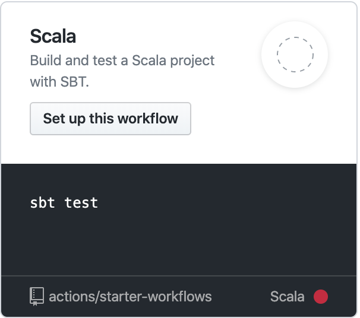

GitHub ActionsでSBTのキャッシュをしたい
===================================

[Scala] [sbt] [GitHubActions]

GitHub Actionsには以下のようにScalaのtestをするworkflowが標準で入っています。



しかしながら、これにはキャッシュの設定がなく、テストのたびにjarのダウンロードが行われちょっと遅さが気になります。
そのため、キャッシュの設定方法の調査と検討を行いました。

## キャッシュ一般の設定方法

[キャッシュの設定方法はヘルプのここに記載されています。](https://help.github.com/ja/actions/configuring-and-managing-workflows/caching-dependencies-to-speed-up-workflows)
このヘルプの通り、 `actions/cache@v1` をstepsに追加すればよいです。
私は `Set up JDK 1.8` の次辺りに入れておきました。

## SBT向けの設定

[SBTに限らず、各処理系向けの設定がここに揃っています。](https://github.com/actions/cache/blob/master/examples.md#scala---sbt)
これによると以下のように設定すれば良いと書かれています。

```yml

- name: Cache SBT ivy cache
  uses: actions/cache@v1
  with:
    path: ~/.ivy2/cache
    key: ${{ runner.os }}-sbt-ivy-cache-${{ hashFiles('**/build.sbt') }}
- name: Cache SBT
  uses: actions/cache@v1
  with:
    path: ~/.sbt
    key: ${{ runner.os }}-sbt-${{ hashFiles('**/build.sbt') }}
```

### 公式の例の問題点

しかしながら、実はこの設定には2点問題があります。

1つは、Coursierプラグインもしくは1.3.x以降を利用している場合、coursierのキャッシュがキャッシュされないという点です。
私は、CIでUbuntuかつSBT1.3.5を使っていたので `~/cache/.coursier` を追加しました。
キャッシュのパスは環境依存なのでWindowsのベースイメージを使う人などは https://get-coursier.io/docs/cache で確認してみてください。

もう1つは、SBTのdependencyは `build.sbt` だけでは決定されないということです。
少なくとも以下が必要なはずです。

- `**/*.sbt`
- `**/project/**/*.scala`
- `**/build.properties`

正しい設定を示す前にそもそもキャッシュのキーになぜファイルのハッシュが必要なのでしょうか。
それには2つの事情があると考えられます。

1つは、多くの処理系では依存パッケージのキャッシュは、依存定義を変えたときキャッシュを破棄しないと安全でないことがあるからというのがありそうです。
例えば、npmではキャッシュがプロジェクトローカルに構成され、起動時に直接読み込まれるので、 `package.json` を変えたときに前のゴミが残っていると予期せぬ動作を引き起こす可能性があります。
別の例としてcabalでは依存するパッケージはソースコードをダウンロードしてローカルでビルドする形式であり、同じバージョンでもその時インストールされているパッケージのバージョンによってビルド結果が変わりうるので、これも予期せぬことが起きることがあります。

これらと比較するとSBTはキャッシュの意味では安全と言えそうです。
SBT向けのjarのキャッシュはオンラインのレポジトリ上にあるバイナリをダウンロードしてくるだけで変化しません。
また、起動時に実際に使われるjarは起動オプションで全て指定するので、余計なバージョンがキャッシュにあっても問題なく動作するはずです。
つまり、SBTでは他の処理系とは異なり、ハッシュで区別せずグローバルに育ててるのがよさそうです。

しかしながら、ここでもう1つの事情に引っかかります。
ヘルプには以下のように書かれています。

> キャッシュをいったん作成すると、既存のキャッシュの内容を変更することはできませんが、新しいキーで新しいキャッシュを作成することはできます。

つまり同じキーでキャッシュを上書きすることはできないので、アップデートしたくなったら何らかの別のキーを生成しそこに保存しなければならないということになります。
そのため例では必要ない処理系でもハッシュを利用しているのではないかと推測されます。
ただし、前述の通りSBTの場合 `hashFiles('**/build.sbt')` では不十分で衝突するため別のキーにする必要があります。

なお、キーを変更した場合でも、 `restore_keys` は接頭辞だけでマッチさせることができます。
複数マッチするときは最新が使われる便利な仕様となっています。

まとめるとキャッシュの更新が行われる可能性がある変更でキャッシュキーが衝突しなければ何でも良いということになります。
私は[使える変数のリスト](https://help.github.com/ja/actions/reference/contexts-and-expression-syntax-for-github-actions)から適当に `github.run_id` を使うことにしました。


## 実際の設定例

実際に設定してみた例をここに貼っておくので参考にしてみてください。
https://github.com/hiroshi-cl/play-routes-wire/blob/master/.github/workflows/scala.yml

該当部分だけ抜き出すと以下のようになります。

```yml

    - name: Cache SBT ivy cache
      uses: actions/cache@v1
      with:
        path: ~/.ivy2/cache
        key: ${{ runner.os }}-sbt-ivy-cache-${{ github.run_id }}
        restore-keys: |
          ${{ runner.os }}-sbt-ivy-cache-
    - name: Cache Coursier cache
      uses: actions/cache@v1
      with:
        path: ~/.cache/coursier
        key: ${{ runner.os }}-sbt-coursier-cache-${{ github.run_id }}
        restore-keys: |
          ${{ runner.os }}-sbt-coursier-cache-
    - name: Cache SBT
      uses: actions/cache@v1
      with:
        path: ~/.sbt
        key: ${{ runner.os }}-sbt-cache-${{ github.run_id }}
        restore-keys: |
          ${{ runner.os }}-sbt-cache-
```

## まとめ

GitHub ActionsでSBTのキャッシュの設定方法とそのようにした理由をまとめてみました。
より良い設定が見つけたらコメントお待ちしています。

